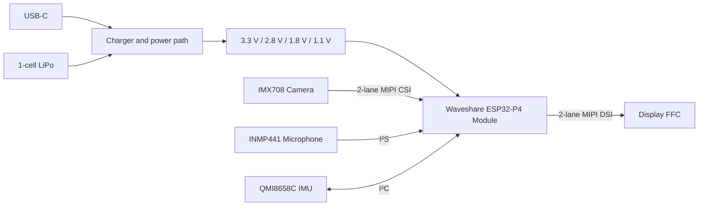

<div align="center">

# Sharingan

### ESP32-P4 camera and display development board

*“I still believe in your eyes.”*

[](https://www.waveshare.com/wiki/ESP32-P4-Module)


A custom vision platform combining an ESP32-P4 application processor, MIPI CSI camera input, MIPI DSI display output, motion sensing, digital audio, USB-C, and battery power on one board.

</div>

---

## Highlights

| Subsystem | Hardware | Purpose |
|---|---|---|
| Compute | [Waveshare ESP32-P4-Module](https://www.waveshare.com/wiki/ESP32-P4-Module) | Main application processor with ESP32-C6 connectivity companion |
| Vision | SpotPear IMX708 camera | Two-lane MIPI CSI image input |
| Display | 15-pin FFC display connector | Two-lane MIPI DSI video output |
| Motion | QMI8658C | Six-axis accelerometer and gyroscope |
| Audio | INMP441 | Digital I²S microphone |
| Power | USB-C and single-cell LiPo | Charging, source selection, and regulated rails |
| Controls | P4 boot, P4 reset, and C6 boot | Direct hardware bring-up and recovery controls |

## Board views

<table>
  <tr>
    <td width="50%" align="center">
      <br>
      <strong>Assembled 3D render</strong>
    </td>
    <td width="50%" align="center">
      <br>
      <strong>Top-side placement</strong>
    </td>
  </tr>
</table>

<div align="center">
  <br>
  <strong>Top copper and routing</strong>
</div>

## System overview



## Project status

| Milestone | State |
|---|---|
| Schematic captured | ✅ Complete |
| Electrical netlist captured | ✅ Complete |
| Schematic and connectivity review | ✅ Complete |
| Stop-before-fabrication corrections | 🚧 Required |
| PCB placement, routing, and stackup review | ⏳ Pending source files or Gerbers |
| Fabrication release | ❌ Not approved yet |

The current revision has a coherent architecture, but it is **not yet recommended for fabrication**. The highest-priority findings involve the ESP32-C6 antenna path, 3.3 V supply margin, charging/input-current assumptions, battery protection, and several interface and development-access details.

Read the full **[schematic and netlist design review](docs/DESIGN_REVIEW.md)** before revising or manufacturing the board.

## Design files

| Artifact | Description |
|---|---|
| [Schematic PDF](design/ESP32P4_Camera_Board_Schematic_2026-08-30.pdf) | EasyEDA schematic reviewed on 2026-08-30 |
| [TEL netlist](design/Netlist_PCB1_2026-08-30.tel) | Electrical connectivity export used for review |
| [Board drawing](drawing.pdf) | Existing board drawing export |
| [Engineering review](docs/DESIGN_REVIEW.md) | Findings, evidence, impact, and recommended corrections |

## Repository layout

```text
Sharingan/
├── design/
│   ├── ESP32P4_Camera_Board_Schematic_2026-08-30.pdf
│   └── Netlist_PCB1_2026-08-30.tel
├── docs/
│   └── DESIGN_REVIEW.md
├── media/
│   ├── sharingan-top-2d.png
│   ├── sharingan-top-3d.png
│   └── sharingan-top-layer.png
├── drawing.pdf
└── README.md
```

## Next revision

- Resolve every stop-before-fabrication item in the engineering review.
- Add the editable PCB source, Gerbers, drill files, stackup, and design rules.
- Verify MIPI routing, return paths, power integrity, thermal copper, RF layout, footprints, and mechanical clearances.
- Run bring-up tests for every power rail and peripheral before full assembly.

---

<div align="center">

Designed by **Tausif Samin** · Sharingan hardware revision **v1.3**

</div>
