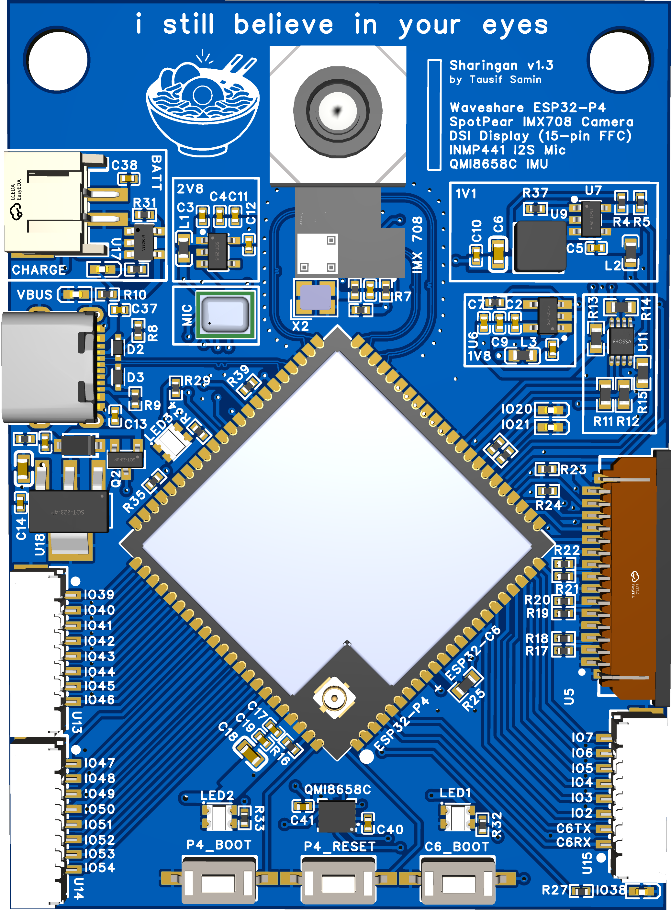
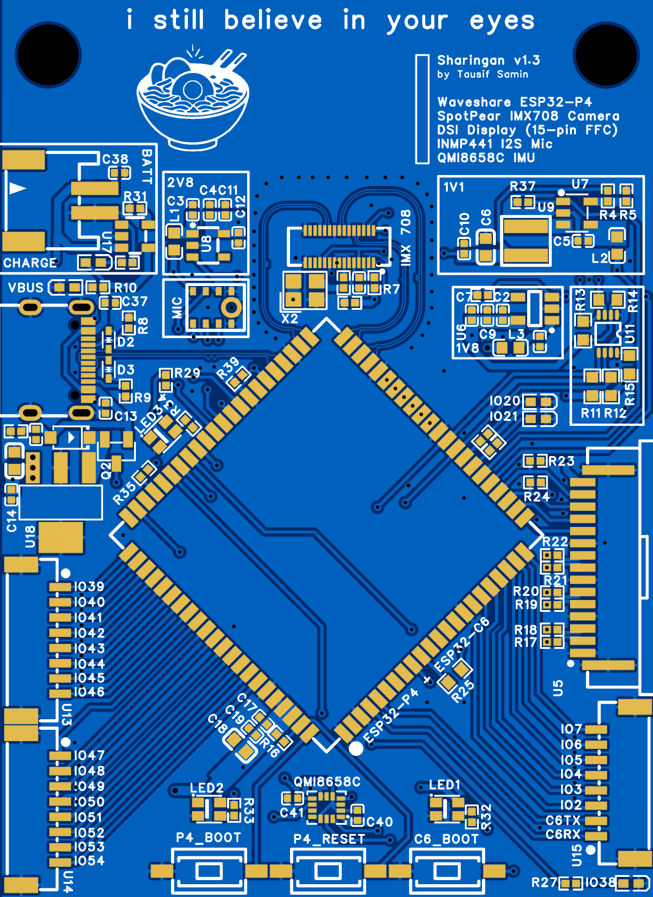
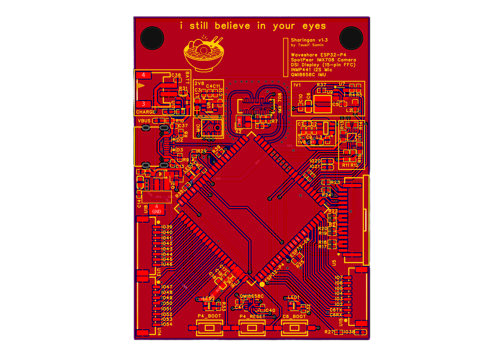
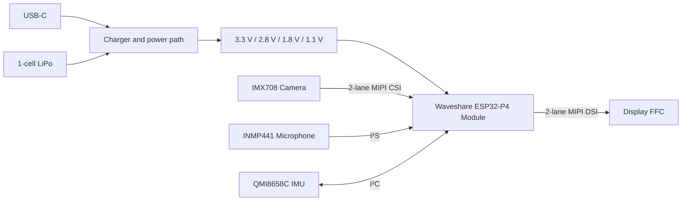

# Sharingan

A Custom embedded vision module with wireless capabilities based on the ESP32-P4 SOM (System On Module) with MIPI CSI, MIPI DSI, motion sensing, digital audio, USB-C, and LiPo Charging with BMS.


> [!WARNING]
> Hardware revision v1.3 is under engineering review and is **not approved for fabrication**. Review the [open design findings](docs/DESIGN_REVIEW.md) before manufacturing or assembly.

## Board views

<table>
  <tr>
    <td width="50%" align="center">
      <br>
      <strong>Assembled 3D render</strong>
    </td>
    <td width="50%" align="center">
      <br>
      <strong>Top-side placement</strong>
    </td>
  </tr>
</table>

<div align="center">
  <br>
  <strong>Top copper and routing</strong>
</div>

## Overview

Sharingan is a custom carrier and peripheral board for the [Waveshare ESP32-P4-Module](https://www.waveshare.com/wiki/ESP32-P4-Module). It connects the ESP32-P4 to a two-lane camera interface, a two-lane display interface, an IMU, a digital microphone, USB-C, and a rechargeable single-cell LiPo power system.

### Hardware

| Function | Device or interface | Notes |
|---|---|---|
| Main compute | Waveshare ESP32-P4-Module | ESP32-P4 application processor with ESP32-C6 connectivity companion |
| Camera | SpotPear IMX708 | Two-lane MIPI CSI |
| Display | 15-pin FFC connector | Two-lane MIPI DSI |
| Motion sensing | QMI8658C | Six-axis accelerometer and gyroscope over I²C |
| Audio input | INMP441 | Digital I²S MEMS microphone |
| Host connection | USB-C | USB data and external power input |
| Portable power | Single-cell LiPo | On-board charging and regulated power rails |
| User controls | P4 boot, P4 reset, C6 boot | Bring-up and recovery buttons |

## Block diagram



## Design files

| File | Description |
|---|---|
| [Schematic PDF](design/ESP32P4_Camera_Board_Schematic_2026-08-30.pdf) | EasyEDA schematic reviewed on 2026-08-30 |
| [TEL netlist](design/Netlist_PCB1_2026-08-30.tel) | Electrical connectivity export used for review |
| [Board drawing](drawing.pdf) | Board drawing export |
| [Design review](docs/DESIGN_REVIEW.md) | Electrical findings, supporting evidence, and required corrections |

Editable PCB source, Gerbers, drill files, fabrication outputs, stackup information, and design-rule settings have not yet been added.

## Review status

| Check | Status |
|---|---|
| Schematic captured | Complete |
| Electrical netlist captured | Complete |
| Schematic and connectivity review | Complete |
| Stop-before-fabrication corrections | Required |
| Placement, routing, and stackup review | Pending PCB source or Gerbers |
| Fabrication release | Not approved |

### Required before fabrication

- Resolve the ESP32-C6 antenna path.
- Re-evaluate the 3.3 V regulator capacity, dropout, and thermal margin.
- Verify USB input-current and battery-charging assumptions.
- Add or document the required LiPo protection strategy.
- Close the remaining interface-voltage, reset, debug-access, decoupling, and MIPI-routing findings.
- Review the physical PCB files for stackup, return paths, RF geometry, thermal copper, footprints, and mechanical clearances.

See [DESIGN_REVIEW.md](docs/DESIGN_REVIEW.md) for the complete review; the list above is only a summary.

## Repository contents

```text
Sharingan/
├── design/
│   ├── ESP32P4_Camera_Board_Schematic_2026-08-30.pdf
│   └── Netlist_PCB1_2026-08-30.tel
├── docs/
│   └── DESIGN_REVIEW.md
├── media/
│   ├── sharingan-top-2d.png
│   ├── sharingan-top-3d.png
│   └── sharingan-top-layer.png
├── drawing.pdf
└── README.md
```

## Revision information

| Item | Value |
|---|---|
| Hardware revision | v1.3 |
| Review date | 2026-08-30 |
| Designer | Tausif Samin |
| Current phase | Design review |

## References

- [Waveshare ESP32-P4-Module wiki](https://www.waveshare.com/wiki/ESP32-P4-Module)
- [ESP32-P4-Module schematic and datasheet](https://files.waveshare.com/wiki/ESP32-P4-Module/ESP32-P4-Module-datasheet.pdf)
- [Espressif ESP32-P4 hardware design guidelines](https://docs.espressif.com/projects/esp-hardware-design-guidelines/en/latest/esp32p4/index.html)
